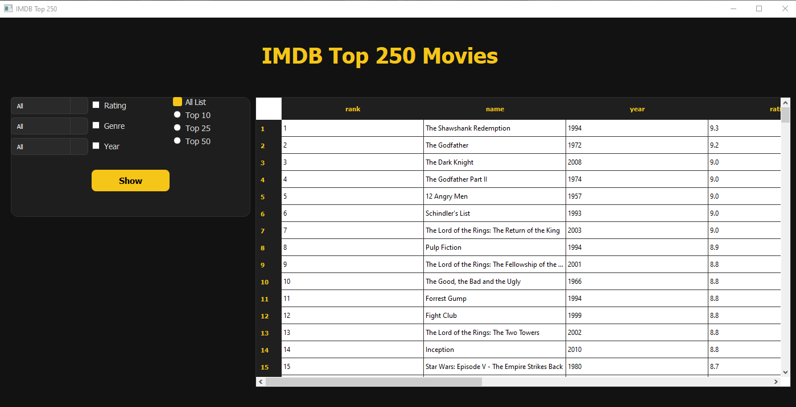

# 🎬 IMDB Top 250 Movies Project



This project is a **PyQt5 desktop application** that allows users to browse and filter the **IMDB Top 250 movies** using a PostgreSQL database.

---

## 🚀 Features

- List IMDB Top 250 movies
- Filter movies by:
  - Genre
  - Year
  - Rating
- View Top 10 / Top 25 / Top 50 movies
- PostgreSQL database integration
- PyQt5 graphical user interface

---

## ⚙️ Setup

### Clone Repository

```bash
git clone https://github.com/user/imdb-movie-browser.git
cd imdb-movie-browser

Install Dependencies

pip install -r requirements.txt

📂 Database Setup (PostgreSQL)

This project uses a PostgreSQL database.
Default PostgreSQL Settings

    Username: postgres

    Port: 5432

Create Database

Open terminal or PostgreSQL shell:

psql -U postgres

CREATE DATABASE movie_250;
\q

Create Tables

From the project root directory, run:

psql -U postgres -d movie_250 -f imdb-250_full.sql

This will create all required tables.
🔐 Environment Variables (.env)

Create a .env file in the project root directory:

DB_HOST=localhost
DB_PORT=5432
DB_USER=postgres
DB_PASSWORD=your_password
DB_NAME=movie_250

⚠️ Do not upload .env to GitHub.
▶️ Run Application

python main.py

If the database is set up correctly, the application will connect automatically.
🧪 Troubleshooting

Error:
FATAL: database "movie_250" does not exist

➡️ Make sure the database is created and the name matches the value in .env.
📌 Notes

    PostgreSQL must be running before starting the application.

    This project uses psycopg2 with DictCursor.

🛠️ Technologies Used

    Python

    PyQt5

    PostgreSQL

    psycopg2


👨‍💻 Author

Developed by [Your Name]